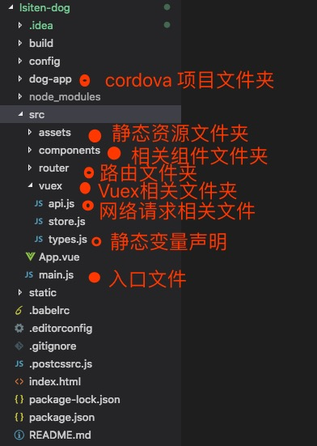
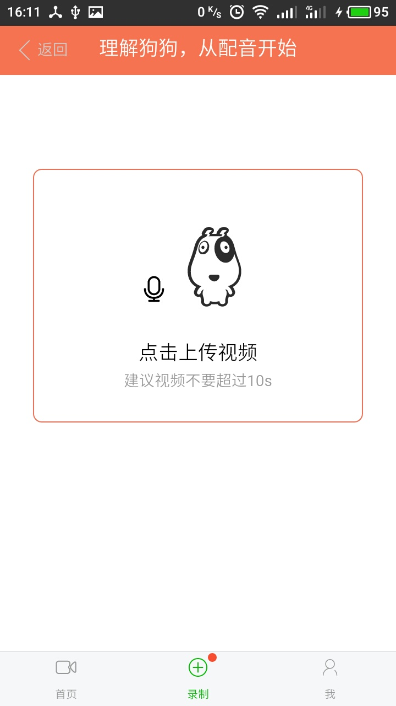
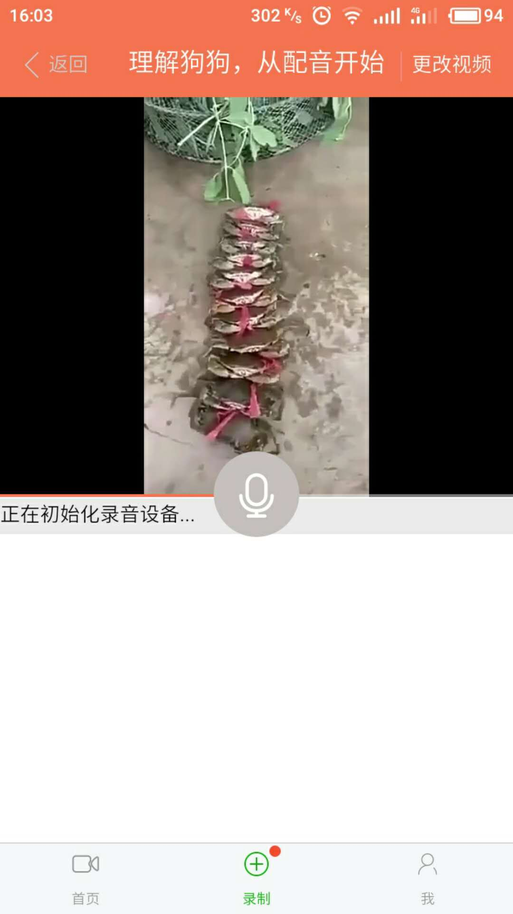
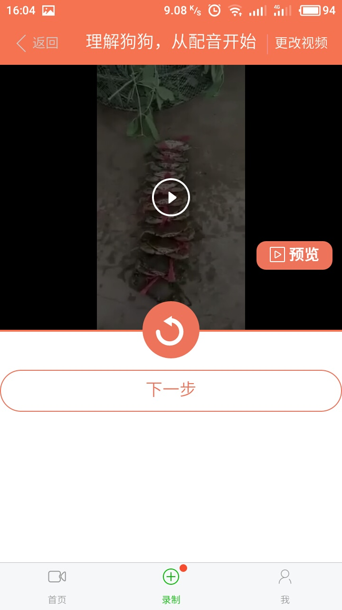
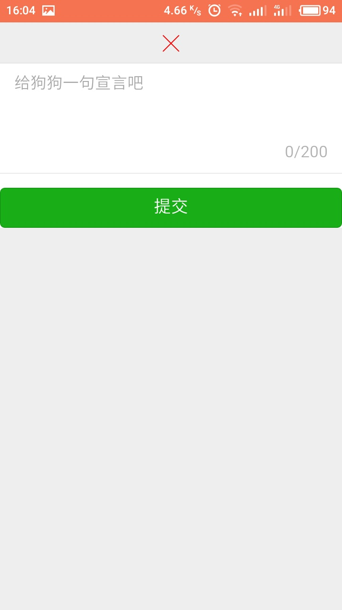
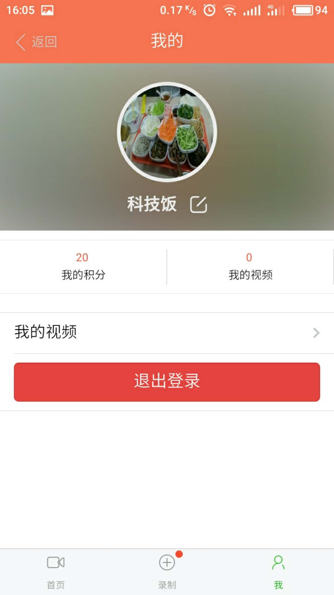

# 狗狗叨叨逼
> Cordova + Vue全家桶（Vue+Vuex+Vue Router+Axios）+ vux 
>
> 一款给狗狗配音的app
## 声明
该App创意来源于慕课网Scott老师的[《贯穿全栈React Native开发App》](http://coding.imooc.com/learn/list/56.html)

## 参考资料
Cordova文档 : [http://cordova.apache.org/docs/en/latest/](http://cordova.apache.org/docs/en/latest/)

Vux文档 : [https://vux.li/#/](https://vux.li/#/)

vue2.0中文文档 : [https://vuefe.cn/v2/guide/](https://vuefe.cn/v2/guide/)

vue-router文档 : [https://router.vuejs.org/](https://router.vuejs.org/)

vuex文档 : [https://vuex.vuejs.org/](https://vuex.vuejs.org/)

数据请求axios : [https://www.npmjs.com/package/axios](https://www.npmjs.com/package/axios)

## 技术栈
>1、Vue.js
>
>2、Vuex【controller(视图控制器) -> actions-> mutations->state->view(视图)】
>
>3、Axios
>
>4、Vue Router
>
>5、Cordova与vue项目结合
>
>6、Cordova media插件实现录音，media capture插件实现视频录制，file实现移动端文件读取，File Transfer实现文件上传
>
>7、localstorage实现数据本地持久话
>
>8、[iconfont图标库的使用](http://iconfont.cn/)
>
>9、螺丝帽Api实现短信验证码
>
>10、七牛图床上传
>
>11、cloudinary图床上传
>
>12、cloudinary视频音频处理API，实现缩略图，视频音频合并【[cloudinary](https://cloudinary.com/documentation/video_manipulation_and_delivery)】
>
>13、使用video自定义h5视频播放器

## 完成功能
>1、App图标，启动页的制作
>
>2、视频模块
   视频列表页面
   视频预览页面
   点赞功能
   评论功能
>
>3、录音模块
   视频音频上传
   录音功能
   视频音频合并功能
   发布创意功能
>
>4、用户模块
    用户登陆注册
    短信验证码
    头像上传/更换
    狗狗信息更改
    我的视频
    用户注销

## 项目结构



使用 vue-cli 工具和 airyland/vux2 模板快速初始化项目修改"config/index.js"
```bash

# 将index的值设置到Cordova项目的www目录下，如本项目的dog-app/www/index.html
index: path.resolve(__dirname, '../dog-app/www/index.html'),

# 将assetsRoot的值设置到Cordova项目的www目录下，如本项目的dog-app/www/
assetsRoot: path.resolve(__dirname, '../dog-app/www'),

# 将assetsSubDirectory值设置成空
assetsSubDirectory: '',

# 将assetsPublicPath值设置成空
assetsPublicPath: '',

```

## 界面预览












##### 最后，如果该demo对你学习vue有帮助，麻烦给个star，谢谢#####

## 开启app

``` bash
# install dependencies
npm install

# build for production with minification
npm run build

# 进入cordova的项目目录
cd dog-app

# 进行编译
cordova run android

```
